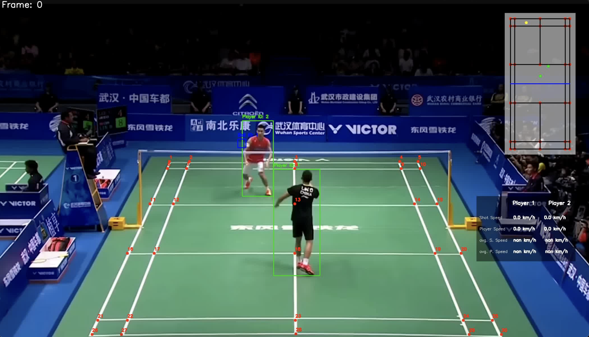

# Badminton Computer Vision Project

## Overview

This project focuses on utilizing computer vision techniques to track players and the birdie in a badminton match. The core functionality includes mapping the positions of the players and the birdie onto a mini-map, providing a real-time overview of the game's dynamics. The project is designed to help players and coaches analyze gameplay, strategies, and movement patterns.

## Features

- **Player Tracking**: Accurately detects and follows the movements of both players on the court.
- **Birdie Tracking**: Tracks the birdie's position during the game.
- **Mini-Map Visualization**: Displays the tracked positions of the players and the birdie on a simplified mini-map representation of the badminton court.
- **Real-Time Analysis**: Provides real-time updates on player and birdie positions, enhancing the ability to analyze gameplay as it unfolds.

